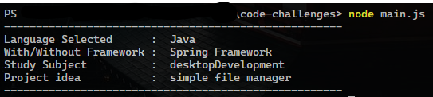
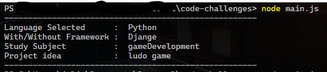
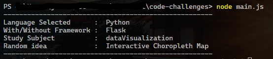
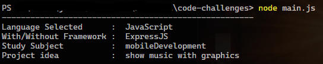

# Generator of random project, language, framework, subject and idea

A basic generator with projects ideas for people who wants to learn some of everything

## Goal

- Make easy to find a project idea to work

## Usage

Clone this repo and in your terminal write:

- `node main.js`

## TODOS

If you to want to collaborate you can help with this tasks

- Complete study subjects for each language
- Add ideasToCode

## EXAMPLES

